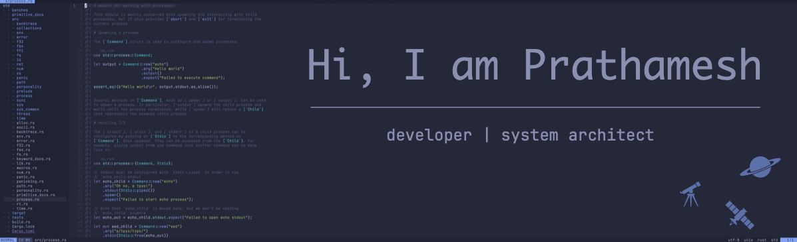

  

  

  

  

  

  

---

### 👦 About Me
- 💻 Experience in designing, developing and delivering enterprise applications

- 🔧 Languages I work on Rust, Golang, TypeScript, Python

- 🧗‍♂️  Like to learn new technologies

- 👨‍💻 A hobbyist programmer too

---

###	🛠️ Skills

---

### 🖋️ Contributions 

  
  
  

  

