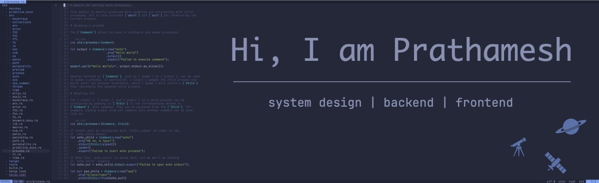

  

  

  

  

  

  

---

### 👦 About Me
- 💻 Good experience in designing and implementing distributed systems that handle many transactions and support high availability

- 🔧 Proficient in development with Golang, Python, Typescript and Rust for building high-performance, concurrent systems

- 👨‍💻 Open source contributor at heart

---

### 🛠️ Skills

---

### 🖋️ Contributions 

  
  
  

